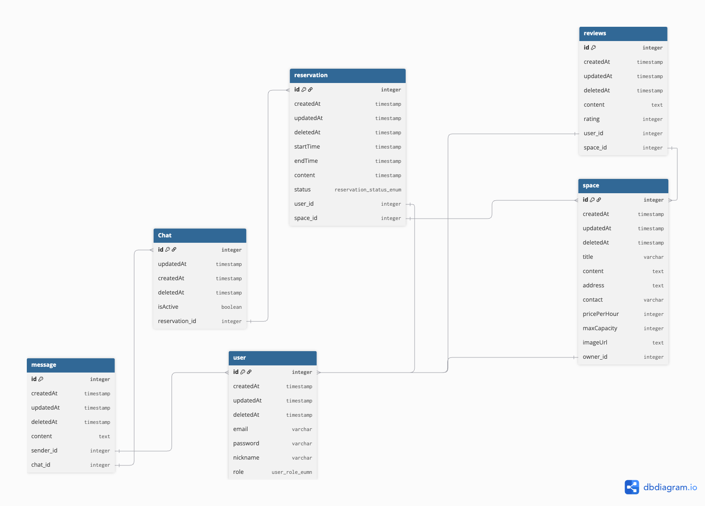

# 소규모 프라이빗 운동 공간 예약 서비스

## 프로젝트 소개

해당 프로젝트 컨셉은 예약제 헬스장 컨셉입니다. 예를 들어 당일은 하체 운동을 하는 날입니다. 헬스장에 방문했을 때 이미 하체 운동하는 사람이 많다면 시간이 소요되고 그 시간 동안 다른 걸 하느라 늦게 운동을 마치는 경험을 한 번쯤 해보신 적 있으신가요?. 이런 불편을 해소하기 위해 시간 단위로 공간을 단독으로 예약할 수 있는 서비스를 만들었습니다.

## 배포

- 배포 주소: http://43.200.251.28:3000
- AWS EC2(Ubuntu) + Docker(PostgreSQL, Redis) + PM2로 배포

## 프로젝트 핵심 기능

1. 시간 슬릇 조회 및 예약
2. 예약 확정 (관리자 승인)
3. 예약 확정 시 채팅룸 자동 생성
4. 예약 시간 전 알림
5. 예약 내 관리자 <-> 사용자 실시간 채팅

## 기술 스택

- **Runtime**: Node.js
- **Framework**: NestJS
- **Language**: TypeScript
- **Database**: PostgreSQL
- **ORM**: TypeORM
- **인증**: Passport, JWT
- **실시간 통신**: WebSocket (Socket.io)
- **스케줄러**: @nestjs/schedule
- **컨테이너**: Docker

## ERD

## 아키텍처

### 인증 흐름

1. 클라이언트가 로그인 요청 액션을 보낸다.
2. BasicTokenGuard에서 email/password 검증
3. JWT Access/Refresh token 발급
4. 이후 요청마다 AccessTokenGuard에서 토큰 검증
5. RoleGuard에서 권한 확인

### 모듈 구조

- AuthModule: 인증/인가
- UsersModule: 유저 관리
- SpacesModule: 공간 관리
- ReservationsModule: 예약 관리
- ChatsModule: 채팅방 관리
- MessagesModule: 메세지 관리
- ReviewsModule: 리뷰 관리
- CommonModule: 공통 라우트 기능 (Pagination)

## API 명세

### Auth

| Method | URL                  | 설명                   | 인증 |
| ------ | -------------------- | ---------------------- | ---- |
| POST   | /auth/register/email | 회원가입               | X    |
| POST   | /auth/login/email    | 로그인                 | X    |
| POST   | /auth/token/access   | refresh = access 발급  | x    |
| POST   | /auth/token/refresh  | refresh = refresh 발급 | x    |

### Spaces

| Method | URL         | 설명           | 인증  |
| ------ | ----------- | -------------- | ----- |
| GET    | /spaces     | 공간 전체 조회 | x     |
| GET    | /spaces/:id | 공간 단일 조회 | x     |
| POST   | /spaces     | 공간 등록      | ADMIN |
| PATCH  | /spaces/:id | 공간 수정      | ADMIN |
| DELETE | /spaces/:id | 공간 삭제      | ADMIN |

### Reservations

| Method | URL                          | 설명           | 인증        |
| ------ | ---------------------------- | -------------- | ----------- |
| GET    | /reservations                | 예약 전체 조회 | AccessToken |
| POST   | /reservations/:spaceId       | 예약 생성      | AccessToken |
| PATCH  | /reservations/:reservationId | 예약 상태 변경 | ADMIN       |

### Reviews

| Method | URL                 | 설명           | 인증        |
| ------ | ------------------- | -------------- | ----------- |
| GET    | /reviews            | 리뷰 전체 조회 | x           |
| POST   | /reviews/:spaceId   | 리뷰 생성      | AccessToken |
| PATCH  | /reviews/:reviewsId | 리뷰 수정      | AccessToken |
| DELETE | /reviews/:reviewsId | 리뷰 삭제      | AccessToken |

### Chats

| Method | URL    | 설명        | 인증        |
| ------ | ------ | ----------- | ----------- |
| GET    | /chats | 채팅방 조회 | AccessToken |

### WebSocket (ws://43.200.251.28:3000/chats)

| 이벤트          | 설명        | 방향             |
| --------------- | ----------- | ---------------- |
| join_room       | 채팅방 입장 | client -> server |
| send_message    | 메시지 전송 | client -> server |
| receive_message | 메세지 수신 | server -> client |

## 트러블슈팅

### 전역 Guard 등록시 의존성 주입 에러

- 문제: APP_GUARD로 AccessTokenGuard 전역 등록 시 AuthService를 찾지 못하는 에러 발생
- 원인: AppModule에서 AuthModule 내부의 AuthService에 접근 불가
- 해결: AuthModule의 exports에 AuthService 추가

### 낙관적 락(Optimistic Lock) 적용

- 문제: 비관적 락 사용 중 소규모 서비스에서 불필요한 잠금이 발생할 수 있다는 판단
- 원인: 충돌 빈도가 낮은 서비스에서는 낙관적 락이 더 적합
- 해결: @VersionColumn()이 정상 동작 하는 것을 확인하고 낙관적 락으로 전환

### RefreshTokenGuard @IsPublic() 누락으로 인한 인증 에러

- 문제: @IsPublic() 누락 으로 토큰 갱신 엔드포인트 에서 인증 에러 발생
- 원인: 서버가 @IsPublic()이 refresh 을 인지 하지 못해서 터짐
- 해결: @IsPublic() 을 사용 할수 있도록 버그 수정

### Redis 연동 문제

- 문제: cache-manager V7과 cache-manager-redis-store V3을 함께 설치 했으나 로그인을 시도할 때 Refresh Token이 Redis에 저장되지 않는 문제가 발생
- 버그 후 대처: 로그를 찍었을 때 에러 없이 정상적으로 출력되긴 했습니다. Redis 컨테이너를 강제로 종료해도 서버에서 에러가 발생하지 않음을 확인했습니다. 이를 통해 NestJS가 Redis에 실제로 연결되지 않고 메모리에 저장하고 있다는 것을 확인했습니다. 디버거 확인 cacheManager 내부에 \_store를 확인한 결과 Redis가 아닌 store로 사용하고 있었습니다.
- 원인: cache-manager V7은 내부 구조가 변경되어 기존 cache-manager-redis-store V3가 호환되지 않는다고 판단 했습니다. 패키지가 서로 다른 방식으로 동작해 Redis 연결 설정을 무시되고 있었습니다.
- 해결: CacheModule 관련 패키지를 모두 제거하고 ioredis를 직접 연결하는 방식으로 교체했습니다. RedisModule을 별도로 만들어 @Global() 로 선언하고 REDIS_CLIENT를 필요한 서비스에 주입하는 구조로 개선 했습니다.

## 실행 방법

1. 레포지토리 클론
   `git clone https://github.com/C-C25/nestjs-reservation-api-project.git`
   `cd nestjs-reservation-api-project`

2. 패키지 설치
   `yarn install`

3. .env 설정
   `cp .env.sample .env`
   .env 파일에 DB, JWT 관련 값 입력

4. Docker 실행
   `docker compose up -d`

5. 서버 실행
   `yarn start:dev`
